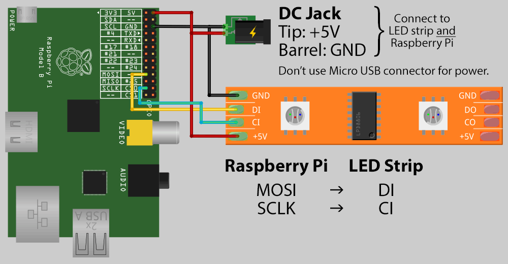
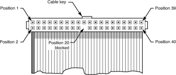

# treelights
Playing with programmable tree lights.

## Setup
```
sudo apt-get install libatlas-base-dev
pip3 install -r requirements.txt
```

Written for Python 3.7.

Install to run on port 80 through nginx:
```
sudo make install
```

Expects an [Adafruit LPD8806 LED
strip](https://learn.adafruit.com/digital-led-strip) wired according to this
diagram:



## Running
Test the strand with some patterns:
```
make test
```

Run server on port 5000:
```
make develop
```

Install service to system:
```
sudo make install
```

Then:
```
sudo systemctl start treelights.service
sudo systemctl stop treelights.service
sudo systemctl enable treelights.service
```

Follow service logs:
```
journalctl -fu treelights.service
```

## References
- https://github.com/adammhaile/RPi-LPD8806/
- http://learn.adafruit.com/light-painting-with-raspberry-pi
- https://www.digitalocean.com/community/tutorials/how-to-serve-flask-applications-with-gunicorn-and-nginx-on-ubuntu-18-04

## Ribbon cable wiring



I put the cable key facing out from the Raspberry Pi board.  This makes the
following cable assignments:

- Position 18 : SCLK / CI
- Position 22 : MOSI / DI
- Position 35 : GND
- Position 39 : +5V
